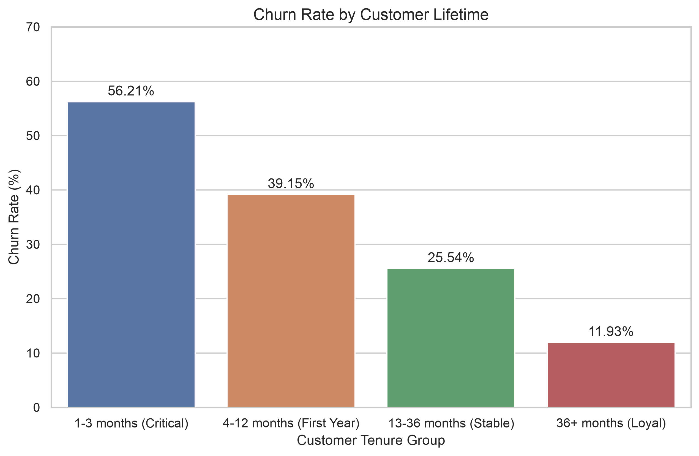
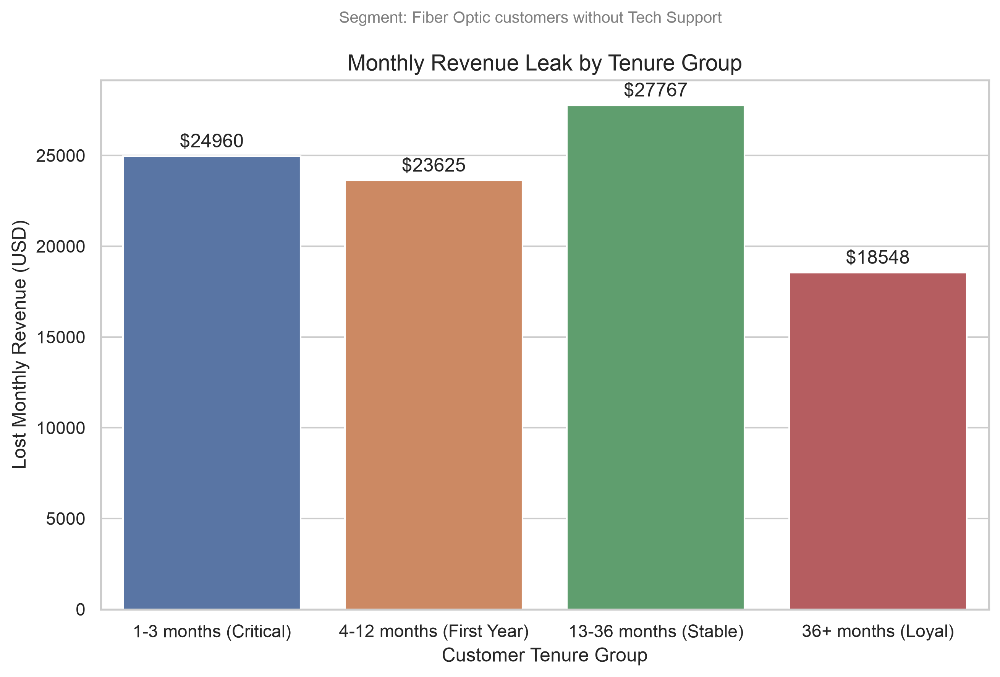
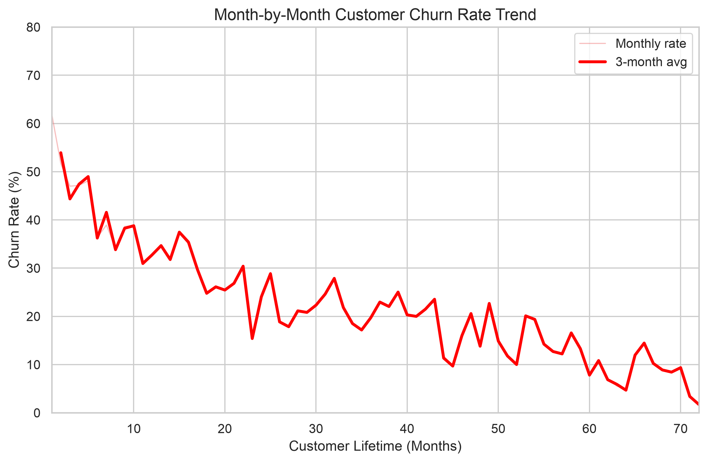
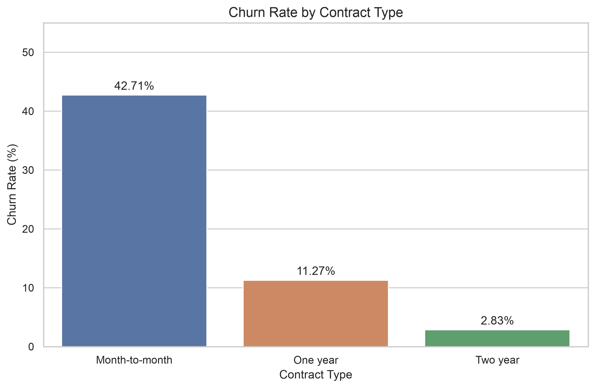
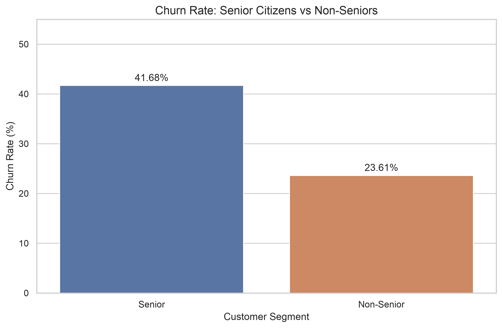

# Customer Churn Analysis & Prevention Strategy

Analysis of customer attrition patterns for a telecom company using SQL and Python.
The project identifies the key drivers of churn, quantifies their financial impact,
and delivers actionable retention recommendations targeting the highest-risk segments.

-----

## Project Overview

26.54% of customers have left the company — roughly 1 in 4. This project breaks down
who is leaving, when, and why, then translates those patterns into concrete business actions.
The analysis combines SQL-based segmentation with Python visualizations to move from
raw data to a prioritized retention strategy.

-----

## Business Objective

Identify the customer segments most at risk of churning, quantify the monthly revenue
loss they represent, and recommend targeted interventions to reduce attrition in the
critical early lifecycle window.

-----

## Dataset

- **Source:** [Telco Customer Churn — Kaggle](https://www.kaggle.com/datasets/blastchar/telco-customer-churn)
- **Size:** 7,043 customers · 21 features
- **Industry:** Telecom
- **Key features:** tenure, contract type, internet service, tech support, monthly charges, total charges, churn status

-----

## Tools & Technologies

- **Python** — pandas, matplotlib, seaborn
- **SQL** — SQLite via sqlite3
- **Jupyter Notebook**

-----

## Project Workflow

1. **Data Loading & Cleaning** — type conversion, null handling, binary encoding
1. **Exploratory Data Overview** — distributions, correlations, baseline statistics
1. **Data Quality Checks** — duplicate detection, null validation, business logic checks
1. **EDA & Base Metrics** — churn by contract, service type, payment method, demographics
1. **Financial Impact Analysis** — revenue loss quantified by segment
1. **Tenure & Cohort Analysis** — churn mapped across the customer lifecycle
1. **Visualizations** — executive-ready charts for stakeholder presentation
1. **Recommendations** — data-backed retention strategy

-----

## Key Insights

- **1 in 4 customers churned** (26.54%), indicating a systemic retention problem rather than isolated incidents.
- **Month-to-month customers churn 15x more** than two-year contract holders (42.71% vs 2.83%). No long-term commitment means any friction leads to an immediate exit.
- **Fiber Optic customers pay the most but churn the most** (41.89%, avg $91.50/month). The premium product has a retention problem.
- **Tech Support cuts churn nearly 3x** (41.64% → 15.17%). It functions as a retention mechanism, not just a feature.
- **61.99% of month-1 customers churn - the highest single-month dropout rate in the entire lifecycle. This is a churn rate, not a share of all churners: the first 3 months combined contribute 31.94% of total attrition, pointing to an onboarding failure, not a product failure.
- **The critical combination:** Fiber Optic + No Tech Support drains **$94,900/month** in lost recurring revenue across all customer cohorts.

-----

## Visualizations

|Chart                          |Description                                                         |
|-------------------------------|--------------------------------------------------------------------|
|Churn Rate by Customer Lifetime|Dramatic drop in churn after 36 months — loyalty compounds over time|
|Monthly Revenue Leak by Tenure |~$24K/month lost at every lifecycle stage in the critical segment   |
|Month-by-Month Churn Trend     |Churn risk concentrated heavily in the first 12 months              |
|Churn Rate by Contract Type    |15x difference between M2M and two-year contracts                   |
|Senior vs Non-Senior Churn     |Seniors churn at nearly 2x the rate of non-seniors                  |






-----

## Business Recommendations

1. **Bundle Tech Support for new Fiber Optic customers** — 3 months free at signup directly targets the $94,900/month revenue leak.
1. **30/60/90 day proactive outreach** — automated check-ins for high-risk cohorts during the critical first quarter.
1. **Early contract incentives** — discounted long-term plans offered before month 4 to reduce M2M exposure before churn risk peaks.

-----

## Project Structure

```
customer-churn-analysis/
├── data/
│   ├── customer-churn.csv        # Raw dataset
│   └── churn_analysis.db         # SQLite database
├── notebooks/
│   └── customer_churn_analysis.ipynb
├── sql/
│   ├── stage2_quality_checks.sql
│   ├── stage3_eda_metrics.sql
│   ├── stage4_financial_impact.sql
│   └── stage5_cohort_analysis.sql
├── visuals/
│   ├── 01_churn_rate_by_tenure.png
│   ├── 02_monthly_leak_by_tenure.png
│   ├── 03_churn_trend_by_month.png
│   ├── 04_churn_by_contract.png
│   └── 05_churn_senior_vs_nonsenior.png
├── requirements.txt
└── README.md
```

-----

## How to Run

```bash
pip install -r requirements.txt
jupyter notebook notebooks/customer_churn_analysis.ipynb
```

-----

## Conclusion

This project demonstrates how structured SQL analysis combined with Python EDA can
turn raw customer data into a prioritized retention strategy. The key finding — that
Fiber Optic customers without Tech Support represent a systemic and quantifiable revenue
leak at every stage of the customer lifecycle — provides a clear, actionable starting
point for the retention team.